# **Advanced Lane Finding** 

## Goals of The Project

* Compute the camera calibration matrix and distortion coefficients given a set of chessboard images.
* Apply a distortion correction to raw images.
* Use color transforms, gradients, etc., to create a thresholded binary image.
* Apply a perspective transform to rectify binary image ("birds-eye view").
* Detect lane pixels and fit to find the lane boundary.
* Determine the curvature of the lane and vehicle position with respect to center.
* Warp the detected lane boundaries back onto the original image.
* Output visual display of the lane boundaries and numerical estimation of lane curvature and vehicle position.

## Code Structure

The main program jupyter notebook is ./P2/P2.ipynb.

The calibration module is ./P2/calibration.py.

The lane detection object is in ./P2/detector.py.

The LaneDetector class contains all image processing and lane detection functions.

## Pipeline

### Camera Calibration and Distortion Correction

The first step of my pipeline is camera calibration and distortion correction. We use the checkerboard calibration module in OpenCV. We extract checkerboard corners from the images in ./camera_cal. The camera matrix and distortion coefficients are computed. We use them to correct images for the rest of the pipeline. The following two images show an original checkerboard image and a corrected one.

Original and corrected images

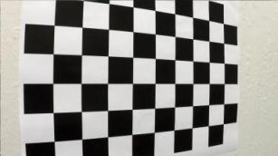 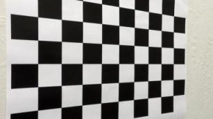

### Thresholding

The next step is to apply different thresholding techniques to get a nice binary image with lane segmented. We use two methods. We find that yellow and white lanes are most clear in the B channel of LAB color space and less sensitive to brightness variation. So we create a binary image by applying a threshold to the B channel.

Original corrected image

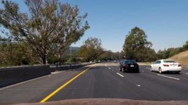 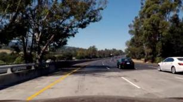

B channel thresholding

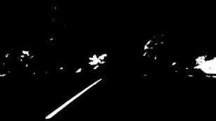 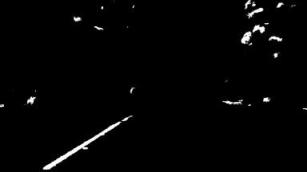

However, B channel thresholding sometime can not find the white lane. So we enhance the pipeline with yellow and white color thresholding as we did in project 1.

Yellow and white space thresholding

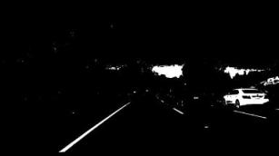 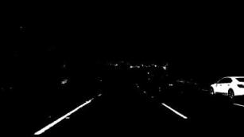

Finally, we combine the B channel binary image and yellow and white space binary image as our image for lane detection.

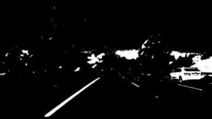 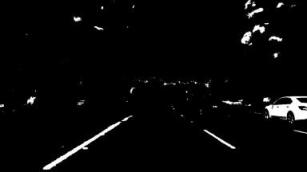

In our pipeline, we did not use gradient information for detecting the lane. During the testing, we find that using gradient information does not provide better results than simply using color space thresholding.

### Bird View

After getting the binary image, we apply a perspective transform to it to get a Bird's View of the lane. First, we define a trapezoid region of interest.

Trapezoid region

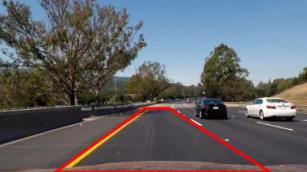 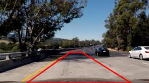

A perspective transform matrix is computed using OpenCV function. Then the binary image is warped into Bird's View

Warped original image for reference

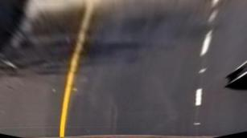 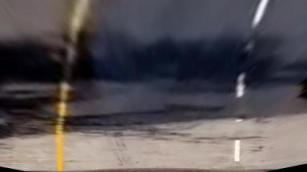

Warped binary image

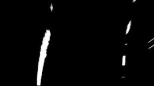 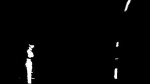

### Sliding Window & Polynominal Neighbor Search

In the lecture, two methods are introduced for lane searching. The first is the sliding window, the second is the search around a polynomial line fitted from the previous frame. In the pipeline, we use a combination of them. We create a state machine with two states. The "Init & Reset" state and "Continuous" state.

"Init & Reset" state, sliding window search

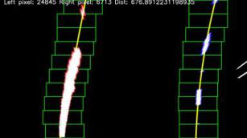 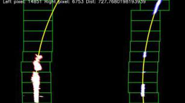

In the beginning, the state machine starts at "Init & Reset", which uses the sliding window for lane finding. We define several criteria for the state machine to transition into the "Continuous" state, which uses a polynomial neighbor search. The criteria include the average distance between two polynomial lines, number of non zero pixels in both searching areas. While in "Continuous" state, if the criteria are not met, the state machine switches back to the "Init & Reset" state.

"Continuous" state, sliding window search

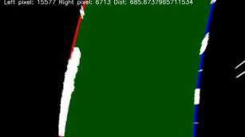 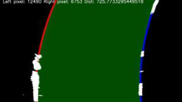

In the challenge video, there are frames where the lighting condition is very bad and the lane detector can not detect any lane. To keep the car on the road, we create a buffer to store lane detection results from several previous frames. When nothing is detected, the best result is picked from the buffer and used.

### Curvature & Car Position Calculation

After getting a good lane search and polynomial fit, we can use the polynomial lines to calculate the curvature of the road and the position of the car. The actual formula is explained in the lecture. The values are computed first in pixel space and then scaled into real-world space.

### Display Result

The lane detection result image is first warped using the inverse of the perspective transformation we calculated before, then overlayed on the corrected original image. Texts showing curvature and position information are drawn on top of that.

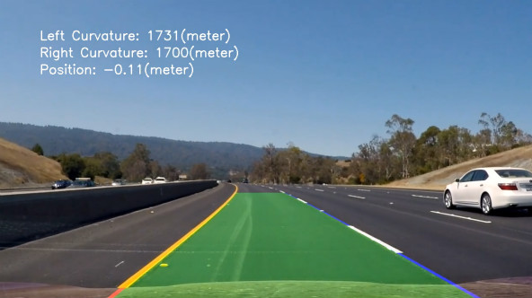

## Project Videos

Project Video

Challenge Video

Harder Challenge Video

Out pipeline does not work well on the harder challenge video, the video below can show some potiential places of problems.

## Potential Shortcomings and Improvements

One shortcoming of the current pipeline is the lane detection is still very sensitive to the lighting condition of the road, and can not tolerate a large amount of shadow. This is easily revealed by the Harder Challenge Video where the lighting condition of the road is continuously changing because of the trees. The avoid this situation. We can try to find a better thresholding method which is more stable or use other sensors like lidar which are less sensitive to lighting condition, or use deep learning method to better segment the lanes.

Another shortcoming is the ROI for computing our Bird's View perspective transform is fixed in the pipeline. When the car is making a sharp turn and lanes curve a lot, they can become skew in the warped image is thus result in no detection.

The third shortcoming of our pipeline is it has too many hardcoded parameters. Extensive parameter tuning is needed once the environment change.

The previous two shortcomings look difficult to solve with rule-based computer vision methods. We can try to use deep learning, such as region-based CNN for better detection.

One more shortcoming of our pipeline is it is not very good to produce a result when nothing is detected. In the pipeline, we had a buffer storing previous frames' results. However, the usage is not at its best. In the future, we can bring in Kalman Filter or other techniques to better predict the lane.